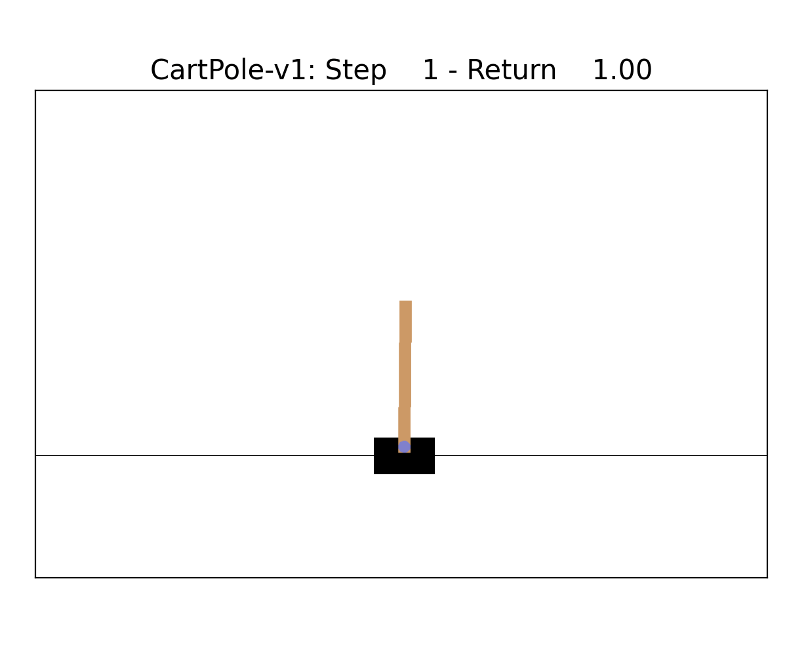

# DTPO: Optimizing Interpretable Decision Tree Policies for Reinforcement Learning

DTPO is an algorithm that combines the gradient-based Proximal Policy Optimization (PPO) algorithm with non-differentiable decision trees to train interpretable policies. This repository also contains implementations of:
- DQN, neural network-based algorithm for reinforcement learning
- PPO, proximal policy optimization with neural networks
- VIPER, learning decision trees for reinforcement learning by imitating a DQN

We ported several environments to [Gymnax](https://github.com/RobertTLange/gymnax) which integrates well with our [JAX](https://github.com/google/jax)-based implementation.

## Installation

We developed DTPO in Python 3.9 but versions >=3.7 should work as well. All required packages can be installed using:
```
pip install -r requirements.txt
```
We recommend using virtual environments. Dependencies such as pytorch are only used for the other implementations as DTPO is based on JAX.

## Running the experiments

To run a model on one of our implemented environments run the appropriate `run_dtpo.py`, `run_viper.py`, `run_ppo.py` or `run_dqn.py` script. You can find out about the supported options by running:
```
python run_dtpo.py -h
```

We also provide shell scripts that run all models and environments that we used in the experiments sequentially: `run_all.sh` and `run_size.sh`. After running these scripts you can run `plot_results.py` and `plot_size.py` respectively to generate the plots and tables.

## Policy visualization

To visualize a trained policy run:

```
python visualize_policy.py ENV_NAME PATH_TO_MODEL_PARAMS
```

This is only supported for the environments that have rendering modes in `gymnax` and unfortunately requires downgrading to `gym==0.19.0` and `pyglet==1.5.27` for now. It will can create gifs such as (CartPole-v1 left, CartPoleSwingup right):

<a href="url"></a>
<a href="url"></a>
